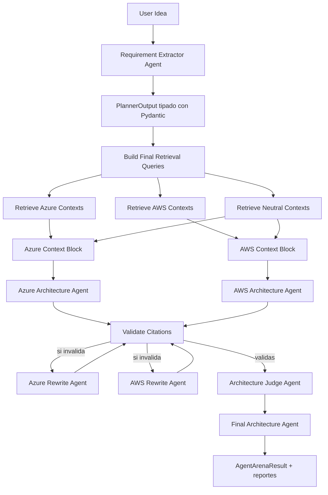
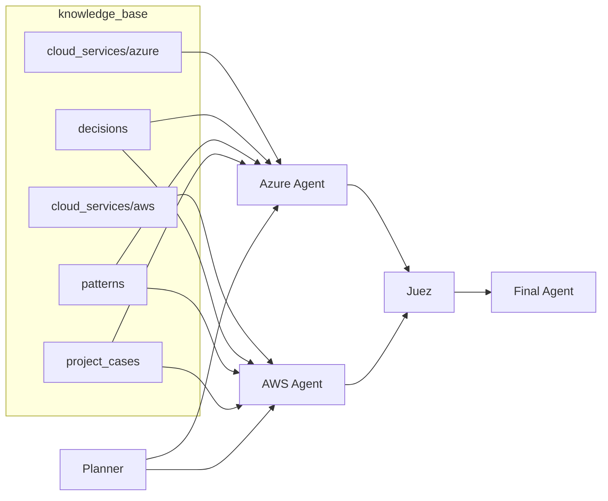

# Reporte técnico y visual — Notebook 04 (`04_dynamic_agent_arena.ipynb`)

## 1) Qué hace el notebook 04 (resumen ejecutivo)

El notebook implementa un **pipeline RAG multi‑agente dinámico** para proponer arquitectura cloud (Azure vs AWS), comparar ambas propuestas y emitir una recomendación final, con control de grounding mediante citas `CTX-XXXX`.

Capacidades principales:
- Planeación dinámica de retrieval desde la idea del usuario (planner LLM + validación Pydantic).
- Recuperación de contexto desde Qdrant por proveedor (`azure`, `aws`, `neutral`).
- Generación concurrente de propuestas Azure y AWS.
- Validación automática de citas y reescritura cuando hay citas inválidas/faltantes.
- Comparador (judge) y síntesis final de arquitectura (en español).
- Trazabilidad opcional con Langfuse.

---

## 2) Flujo end-to-end del notebook

---

## 3) Identidad de cada agente (rol, entradas, salidas)

| Agente | Identidad/Persona | Entrada principal | Salida |
|---|---|---|---|
| Requirement Extractor | Agente de extracción de requisitos cloud | `user_idea` + `business_context` | JSON estructurado (`PlannerOutput`) con capacidades, constraints y queries |
| Azure Architecture Agent | Senior Azure architect | `user_idea` + `planner_output` + `azure_context_block` | `# Azure Architecture Proposal` con citas CTX |
| AWS Architecture Agent | Senior AWS architect | `user_idea` + `planner_output` + `aws_context_block` | `# AWS Architecture Proposal` con citas CTX |
| Citation Validator | Validador determinístico (función) | Propuesta + set de IDs válidos | `CitationValidation` (`valid`, `invalid_ids`, etc.) |
| Rewrite Agent (Azure/AWS) | Revisor de grounding | Propuesta inválida + contexto + IDs permitidos | Propuesta reescrita sin claims/citas no soportadas |
| Architecture Judge Agent | Juez comparador grounded | Propuesta Azure + propuesta AWS | `# Architecture Comparison` |
| Final Architecture Agent | Senior solution architect | Propuestas + comparación del juez + contexto | `# Propuesta Final de Arquitectura` (español, ejecutiva) |

---

## 4) Cómo usa `knowledge_base` para responder

### 4.1 Mecanismo

1. **No consulta markdown en vivo**: usa embeddings ya indexados en Qdrant (`agent_arena_knowledge_base`).
2. `retrieve_contexts(query, provider, top_k)`:
   - Embebe la query (`all-MiniLM-L6-v2`).
   - Filtra por `provider` con `build_provider_filter`.
   - Recupera payloads con `context_id`, `chunk_text`, `source_file`, `section_path`, etc.
3. Arma bloques de evidencia:
   - Azure agent: `azure_contexts + neutral_contexts`
   - AWS agent: `aws_contexts + neutral_contexts`
4. Fuerza grounding:
   - Reglas estrictas en prompts (`GROUNDED_RULES`).
   - Citas obligatorias `CTX-XXXX`.
   - Validación posterior + reescritura.

### 4.2 Tipos de archivos dentro de `knowledge_base`

| Carpeta | Propósito en el sistema |
|---|---|
| `cloud_services\azure` | Referencias de servicios/patrones Azure |
| `cloud_services\aws` | Referencias de servicios/patrones AWS |
| `decisions` | Decision records (ADRs) reutilizables para justificar elecciones |
| `patterns` | Patrones neutrales (cross-cloud), base para contexto neutral |
| `project_cases` | Casos reales/ejemplos para analogía y diseño práctico |

### 4.3 Inventario de archivos `knowledge_base` (23)

#### Azure (`cloud_services\azure`)
- `azure_agentic_app.md`
- `azure_blob_storage.md`
- `azure_container_apps.md`
- `azure_functions_event_ingestion.md`
- `azure_serverless_app.md`

#### AWS (`cloud_services\aws`)
- `amazon_s3_document_storage.md`
- `aws_agentic_app.md`
- `aws_ecs_fargate.md`
- `aws_lambda_event_ingestion.md`
- `aws_serverless_app.md`

#### Decision records (`decisions`)
- `aws_lambda_for_event_ingestion.md`
- `azure_ai_search_for_enterprise_rag.md`
- `azure_container_apps_for_agent_deployment.md`
- `bedrock_knowledge_bases_for_aws_rag.md`
- `ecs_fargate_for_agent_deployment.md`
- `qdrant_for_local_mvp.md`

#### Patrones (`patterns`)
- `architecture_patterns.md`
- `event_driven_document_ingestion_pattern.md`
- `grounded_rag_agent_pattern.md`
- `multi_agent_architecture_advisor_pattern.md`

#### Casos (`project_cases`)
- `document_architecture_advisor.md`
- `pmo_project_status_assistant.md`
- `remittance_pdf_extraction_to_bi.md`

---

## 5) Mapa visual de uso de knowledge_base por agente

---

## 6) Funciones clave del notebook 04 (referencia rápida)

- Retrieval y contexto:
  - `build_provider_filter`
  - `retrieve_contexts`
  - `build_dynamic_context_pack_with_llm_planner_async`
- Planeación:
  - `build_requirement_extractor_prompt`
  - `extract_requirements_with_llm_async`
  - `build_final_retrieval_queries`
- Agentes de propuesta:
  - `build_azure_agent_prompt_typed`
  - `build_aws_agent_prompt_typed`
- Control de grounding:
  - `get_valid_context_ids_typed`
  - `validate_citations_typed`
  - `build_rewrite_prompt_typed`
- Decisión final:
  - `build_judge_prompt_typed`
  - `build_final_architecture_prompt_typed`
  - `run_agent_arena_with_llm_planner_pydantic_async`

---

## 7) Artefactos de salida del pipeline

El notebook genera/ha generado reportes en `data\agent_outputs`, por ejemplo:
- `agent_arena_dynamic_llm_planner_pydantic_report.md`
- `agent_arena_dynamic_llm_planner_pydantic_result.json`
- `azure_proposal.md`
- `aws_proposal.md`
- `final_comparison.md`

Este reporte está pensado para exportar directamente a PDF/HTML desde Markdown.

