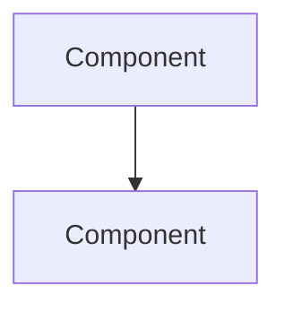

# Project Case: [Nombre del Proyecto]

**Provider:** [azure | aws | gcp | neutral]
**Document type:** project_case
**Industry:** [Sector — e.g. fintech, healthcare, retail, consulting]
**Company size:** [startup | SMB | enterprise]
**Date:** [YYYY-MM]

## Business Context

<!-- Describe the problem the business was trying to solve. Be specific:
     - What was the pain point?
     - Who were the users?
     - What was the scale (users, documents, transactions)?
     - What was the timeline/urgency? -->

## Why This Cloud Provider Was Chosen

<!-- The real reasons — technical AND business:
     - Was it a technical decision or a business/compliance one?
     - What alternatives were evaluated?
     - What tipped the decision? (existing contracts, team expertise, compliance, cost)
     - Who made the final call? (engineering, CTO, procurement) -->

## Architecture Implemented

<!-- Describe the actual architecture with specific services and tiers:
     - List each component with its exact configuration (tier, size, region)
     - Include a Mermaid diagram if possible
     - Distinguish MVP from production architecture -->

### Components

| Component | Service | Tier/Config | Role |
|-----------|---------|-------------|------|
| ... | ... | ... | ... |

## What Worked Well

<!-- With concrete metrics when possible:
     - Latency numbers (p50, p99)
     - Throughput achieved
     - Cost vs budget
     - Time to deploy
     - Developer experience -->

## What Went Wrong

<!-- Be honest — this is the most valuable part:
     - Unexpected limitations discovered in production
     - Performance issues
     - Cost surprises
     - Integration problems
     - Workarounds applied -->

## Real Monthly Costs

<!-- Actual costs, not estimates:
     - Breakdown by service
     - What was surprisingly expensive
     - What was cheaper than expected
     - Total monthly burn -->

| Service | Monthly Cost | Notes |
|---------|-------------|-------|
| ... | $... | ... |
| **Total** | **$...** | |

## Lessons Learned

<!-- What would you do differently today:
     - Architecture changes
     - Service choices
     - Process improvements
     - Team/skills gaps identified -->

## Key Decision Points

<!-- For each major decision, document:
     - What was decided
     - What alternatives were considered
     - Why this option was chosen
     - What trade-off was accepted -->
